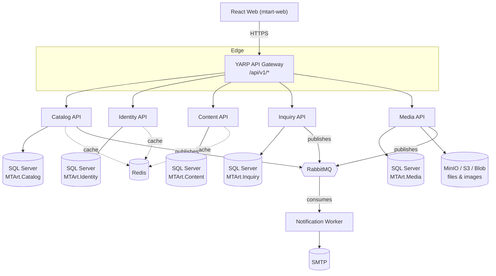

# MT ART — Architecture Overview

## 1. Style

MT ART is built as a set of independently deployable **.NET 10 microservices** behind a single
**YARP API Gateway**, each following **Clean Architecture** (Domain → Application → Infrastructure → Api)
with **CQRS** for use cases. The public/admin frontend is a single **React 19 + TypeScript** SPA.



## 2. Why microservices, and why these boundaries

Each service owns exactly one bounded context and its own database/schema; no service reads another
service's tables directly. Cross-service communication is either:

- **Synchronous, read-only, via the Gateway** (e.g. the web app calls Catalog and Content independently
  and composes the page), or
- **Asynchronous, via RabbitMQ/MassTransit integration events** for side effects that must not block the
  request that triggered them (e.g. `QuotationRequested` → email notifications).

| Service | Owns | Does NOT own |
|---|---|---|
| Identity | admins/editors/sales accounts, roles, JWT/refresh tokens | public customers (they never need an account) |
| Catalog | categories, collections, products, variants, colors, formats, shapes, finishes | media files themselves (only references `MediaId`) |
| Content | CMS pages, projects, blog, FAQs, catalogs, navigation, SEO metadata, settings | product data |
| Inquiry | quote/sample/contact requests, lead lifecycle | sending the actual email (delegated to Notification) |
| Media | file metadata, responsive variants, alt text | business meaning of a file (that lives in Catalog/Content) |
| Notification | consuming events, sending transactional email | nothing persistent/public-facing |

## 3. Why CQRS with a custom mediator instead of MediatR

MediatR and AutoMapper moved to a paid commercial license in 2025. To avoid encumbering this project with
hidden license costs, `MTArt.SharedKernel.Cqrs` implements a small, first-party `IRequest` / `IRequestHandler`
/ `IPipelineBehavior` / `ISender` pipeline that is API-compatible with the MediatR patterns most .NET
developers already know, plus a `ValidationBehavior` that runs FluentValidation validators automatically.
Mapping is done with explicit `ToDto()` extension methods per feature — easier to debug, refactor, and
step through than reflection-based mapping.

## 4. Why the `Result` pattern

Application handlers return `Result` / `Result<T>` instead of throwing exceptions for expected business
failures (not found, validation, conflict). `ResultEndpointExtensions.ToProblemResult()` converts a failed
`Result` into an RFC 7807 `ProblemDetails` response with the right HTTP status code. Exceptions are reserved
for truly unexpected failures and are caught centrally by `GlobalExceptionHandler`.

## 5. Why a single Gateway

The browser never talks to a microservice directly. `MTArt.ApiGateway` (YARP) is the only public backend
entry point:

- one CORS policy, one HTTPS certificate, one rate-limiting policy to configure,
- services can be moved, split, or rescaled without the frontend noticing,
- future cross-cutting concerns (auth, request logging, response caching) are added once, at the edge.

Routes are configured declaratively in `appsettings.json` under `ReverseProxy:Routes`/`Clusters` — see
`src/Gateway/MTArt.ApiGateway/appsettings.json` (container DNS names, used in Docker) and
`appsettings.Development.json` (localhost ports, used when running services with `dotnet run` outside
Docker).

## 6. Rendering / SEO strategy

See [seo.md](./seo.md) for the full rationale. Summary: public marketing/catalog routes are pre-rendered
at build/deploy time (or served through an SSR/prerender middleware) so crawlers and social previews see
fully-formed HTML; the `/admin` app remains a pure client-rendered SPA since it is never indexed.

## 7. Solution layout

```text
MTArt/
├── src/
│   ├── BuildingBlocks/     Shared kernel, observability, event bus, cross-service contracts
│   ├── Gateway/            YARP reverse proxy (MTArt.ApiGateway)
│   ├── Services/           One folder per microservice, each Domain/Application/Infrastructure/Api
│   └── Web/                React 19 + TypeScript SPA (mtart-web) — Phase 3+
├── tests/
│   ├── UnitTests/          Per-service domain + application tests (xUnit + AwesomeAssertions)
│   ├── IntegrationTests/   API-level tests (Testcontainers where needed)
│   └── ArchitectureTests/  NetArchTest rules (Domain must not depend on Infrastructure/EF/API)
├── deploy/
│   ├── docker/             One Dockerfile per deployable + nginx config for the SPA
│   └── scripts/            Operational helper scripts
├── docker-compose.yml       Full local environment: SQL Server, Redis, RabbitMQ, MinIO + every service
└── docs/                    This folder
```

## 8. Local environment topology (docker-compose)

| Service | Container | Public port (host) |
|---|---|---|
| SQL Server | `mtart-sqlserver` | 1433 |
| Redis | `mtart-redis` | 6379 |
| RabbitMQ (AMQP / management UI) | `mtart-rabbitmq` | 5672 / 15672 |
| MinIO (S3 API / console) | `mtart-minio` | 9000 / 9001 |
| Identity API | `mtart-identity-api` | internal only, via gateway |
| Catalog API | `mtart-catalog-api` | internal only, via gateway |
| Content API | `mtart-content-api` | internal only, via gateway |
| Inquiry API | `mtart-inquiry-api` | internal only, via gateway |
| Media API | `mtart-media-api` | internal only, via gateway |
| Notification Worker | `mtart-notification-worker` | none (background consumer) |
| Gateway | `mtart-gateway` | 8080 |
| Web (Phase 3+, `--profile web`) | `mtart-web` | 5173 |

Individual APIs are **not** published on host ports in Docker on purpose — everything goes through the
gateway on port 8080, matching production topology. When running services individually with `dotnet run`
during day-to-day backend development, each still binds to its own `launchSettings.json` port
(see `appsettings.Development.json` in the Gateway project for the mapping).
